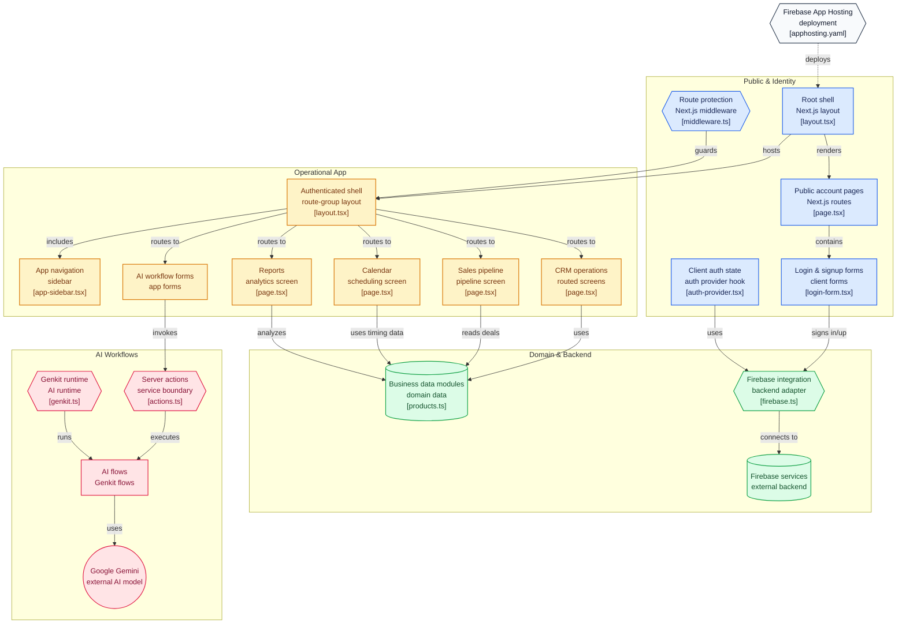

# GearLink CRM

Welcome to **GearLink**, a comprehensive CRM and business management application built with Next.js and Firebase, designed specifically for auto parts stores. GearLink leverages AI-powered features to streamline operations, enhance customer engagement, and boost sales.

This project was built in Firebase Studio.

## Key Features

- **Authentication**: Secure user sign-up and login functionality using Firebase Authentication.
- **Dashboard**: An at-a-glance overview of key business metrics, including total revenue, customer statistics, stock levels, and recent sales activity.
- **Point of Sale (POS)**: A user-friendly interface for processing sales, managing a shopping cart, and finalizing transactions.
- **Product Management**: Easily manage your product inventory, including details, pricing, and stock levels.
- **Customer Management**: Maintain a database of your customers, track their status, and view their purchase history.
- **Sales Pipeline**: A visual Kanban board to track sales deals through various stages, from "New Lead" to "Closed - Won".
- **Task Management**: Organize and track team tasks, assign priorities, and monitor statuses.
- **Calendar View**: A unified calendar that displays tasks and invoice due dates to help your team stay organized.
- **Sales Reports**: Visualize sales data with charts for monthly sales, category-wise breakdowns, and top-selling products. Includes an AI-powered summary generator.
- **Invoice Management**: Create, view, and track invoices. Includes features for sending reminders and downloading PDFs.

### AI-Powered Tools

- **Smart Part Finder**: An intelligent search tool that uses AI to recommend compatible parts and accessories based on vehicle specifications.
- **AI Email Marketer**: Generate compelling marketing emails for promotional campaigns by simply describing the offer.

## Tech Stack

- **Framework**: Next.js with App Router
- **Backend & Authentication**: Firebase
- **Generative AI**: Google's Gemini models via Genkit
- **UI**: React, TypeScript, ShadCN UI, Tailwind CSS
- **Styling**: Tailwind CSS
- **Charts**: Recharts
- **Forms**: React Hook Form with Zod for validation

## Getting Started

To get the application running locally, follow these steps:

1.  **Install Dependencies**:
    ```bash
    npm install
    ```

2.  **Run the Development Server**:
    ```bash
    npm run dev
    ```
    This command starts the Next.js development server, typically on `http://localhost:9002`.

3.  **Run the Genkit Development Server**:
    For AI features to work, you need to run the Genkit server in a separate terminal.
    ```bash
    npm run genkit:dev
    ```
    This starts the Genkit server, which manages the AI flows.

Now you can open [http://localhost:9002](http://localhost:9002) in your browser to see the application.


# Architecture


